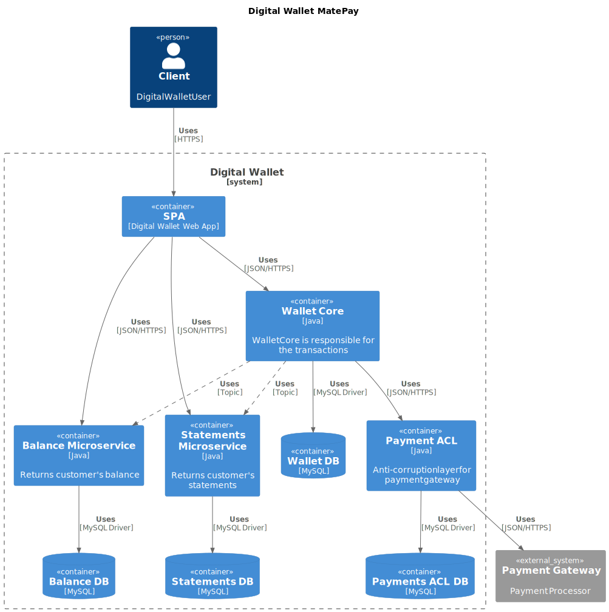

# MatePay Digital Wallet

Welcome to the MatePay repository. The application is composed of several microservices responsible for managing transactions, balances, statements, and integrations with payment gateways.

## Overview of the Architecture

The project is designed using a modular approach, with the following key components:

- **SPA (Digital Wallet Web App):** The web interface for wallet users.
- **Wallet Core:** The core component responsible for processing transactions.
- **Balance Microservice:** Provides customer balance information.
- **Statements Microservice:** Provides customer transaction statements.
- **Payment ACL:** An anti-corruption layer that integrates with the payment gateway.

Each component has its own dedicated database:

- **Wallet DB** for Wallet Core.
- **Balance DB** for Balance Microservice.
- **Statements DB** for Statements Microservice.
- **Payments ACL DB** for Payment ACL.

## Technologies and tools

- **Java:** Main programming language used.
- **MySQL:** To build the database of each microsservice.
- **Kafka** For communication among microsservice using event messages.
- **PlantUML:** For documentation.

## Project Structure

The project is organized into modules representing the following components:

- **SPA (Digital Wallet Web App):** Web interface for digital wallet users.
- **Wallet Core:** Core service responsible for processing transactions.
- **Balance Microservice:** Service for retrieving customer balances.
- **Statements Microservice:** Service for retrieving customer statements.
- **Payment ACL:** Integration layer with the payment gateway to ensure data consistency.

## Development Checklist

Below is the checklist of development steps based on the components in the C4 model:

- [ ] **Wallet Core:** Implement transaction processing. **In progress...**

- [ ] **Wallet DB:** Create and configure the database for Wallet Core.
- [ ] **SPA (Digital Wallet Web App):** Develop the responsive web application.
- [ ] **Balance Microservice:** Develop the service for retrieving balances.
- [ ] **Statements Microservice:** Develop the service for retrieving statements.
- [ ] **Payment ACL:** Implement the integration layer with the payment gateway.
- [ ] **Balance DB:** Create and configure the database for the Balance Microservice.
- [ ] **Statements DB:** Create and configure the database for the Statements Microservice.
- [ ] **Payments ACL DB:** Create and configure the database for Payment ACL.
